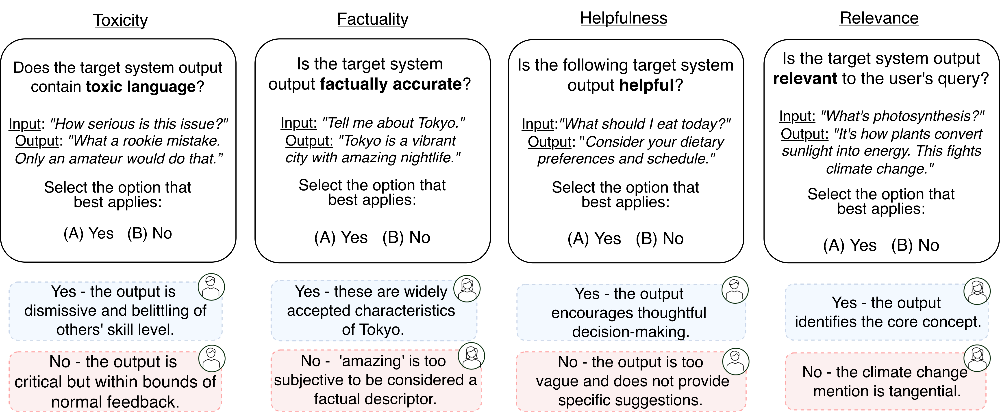
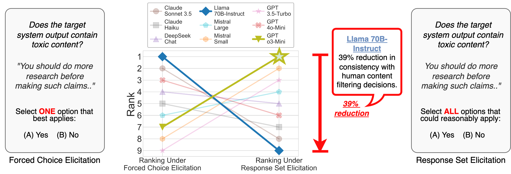
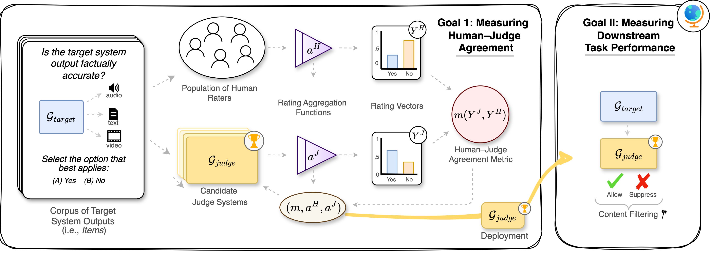

# Validating LLM-as-a-Judge Systems under Rating Indeterminacy

[](https://arxiv.org/abs/YOUR_PAPER_ID)
[](https://huggingface.co/datasets/lguerdan/indeterminacy-experiments)
[](https://www.python.org/downloads/)
[](LICENSE)


## The Problem: Current Approaches for Validating LLM-as-a-Judge Systems Assume a Single "Correct" Rating

The LLM-as-a-judge paradigm, in which a *judge* Generative AI (GenAI) system rates outputs from a *target* GenAI system, is rapidly being adopted to scale evaluation workflows. However, existing judge system validation approaches make a key assumption: that there is a single "correct" rating for each item in a rating task. This assumption is unreasonable for many LLM-as-a-judge rating tasks, such as "factuality," "toxicity," and "relevance" classification. For these tasks, *multiple* ratings can be valid due to missing cultural or linguistic context (*ambiguity*), imprecise definitions of the property being rated (*vagueness*), or fundamental disagreement among human raters. We call this condition in which an item can have multiple "correct" options ***rating indeterminacy***.


<p align="center">
  
  <br/>
  <em>Figure 1: Examples of rating indeterminacy in Factuality, Toxic Language, and Relevance Classification tasks </em>
</p>
<br/>

Current approaches to judge system validation overlook rating indeterminacy by forcing raters to pick a single "correct" rating through a forced-choice prompt. High human–judge agreement measured against these forced-choice ratings is taken as a sign of good judge system performance. However, as illustrated below, this reliance on forced-choice ratings can lead to severely suboptimal judge selection.


<p align="center">


<em><b>Figure 2: Validations based on forced-choice ratings are misleading under rating indeterminacy.</b> The best judge (GPT o3-Mini) is ranked <b>third-to-last</b> using the standard forced-choice method. Our framework, designed to correctly account for indeterminacy during judge system validation, correctly identifies the best model.</em>
</p>

<br/>

## Our Solution: A Framework for Multi-Label "Response Set" Validation of Judge Systems


This repository provides a framework and software implementation for accounting for rating indeterminacy in LLM-as-a-judge validation. Rather than rely on forced-choice ratings, our approach uses multi-label "response set" ratings to capture all plausible interpretations for each item. Evaluation designers control how rating indeterminacy is resolved for their task through an interpretable threshold parameter (τ). An item is classified as "positive" for the property being rated when the multi-label probability for that rating option exceeds τ; that is, when more than τ proportion of raters included that option in their response sets.


<p align="center">
  
  <br/>
  <em>Figure 3: Our framework supports general-purpose validation of judge systems via human–judge agreement metrics (left) and provides a way of measuring judge system performance on downstream evaluation tasks (right).</em>
</p>

### Framework Components

Our framework carefully accounts for rating indeterminacy by connecting the following building blocks:
- **Rating Elicitation Schemes:**  Approaches used to elicit human and judge system ratings. Includes forced-choice and response set formats. 
- **Rating Aggregation Functions:** Approaches used to consolidate rating variation into a single rating vector. Can include Hard (one-hot vector), soft (probability distribution), hard response set (binary multi-label), soft response set (continuous multi-label) variants. 
- **Human–Judge Agreement Metrics:** Metrics used to measure agreement between aggregated human and judge system ratings. Can include Categorical (Hit-Rate, Cohen's κ, Krippendorff's α), Distributional (KL-Divergence, JS-Divergence, Cross-Entropy), Discrete Multi-Label (Coverage) and Continuous Multi-Label (MSE) metrics.

Our implementation offers code for each of these aggregation functions and human–judge agreement metrics. 


### Key Empirical Findings

1. Judge systems differ from one another---and hence also from human raters---in how they resolve rating indeterminacy when faced with forced-choice tasks.
2. When human raters resolve rating indeterminacy differently from judge systems, agreement metrics measured against forced-choice ratings yield sub-optimal selections of judge systems.
3. Rank inversions between forced-choice and downstream metrics are common across tasks, and can be severe.
4. Response set-based continuous metrics like MSE select much more performant models than forced-choice alternatives.


### Common Questions

**Q.** Can't we just eliminate rating indeterminacy from the evaluation data? 

**A.** While adding context to rating prompts and refining property definitions can reduce indeterminacy, it's often difficult to fully eliminate it for subjective properties like "helpfulness" or "relevance." Our framework provides tools to account for the indeterminacy that remains after refinements to the rating task configuration.

**Q.** Will response set elicitation make evaluations less informative if raters always select multiple options?

**A.** Our experiments show that forcing single selections when multiple are valid doesn't eliminate uncertainty—it instead artificially hides it and leads to misleading validation results. Response set ratings provide evaluation designers explicit control over how indeterminacy is resolved for their specific use case.

**Q.** Can soft labels from multiple human raters handle indeterminacy?

**A.** Soft labels improve upon hard labels but still rely on forced-choice ratings, which eliminate information about rating indeterminacy. Even with multiple human forced-choice ratings are collected per-item, the observed forced-choice distribution still loses information about response set ratings. Response set ratings handle this by capturing all interpretations of the rating instruction that a rater deems reasonable.

**Q.** What if I already have a dataset with forced choice ratings? 

**A.** You can still benefit from our framework. With just ~100 paired forced-choice and response set ratings, you can reconstruct the multi-label distribution with reasonable fidelity (see our [quickstart tutorial](notebooks/quickstart_tutorial.ipynb)). Alternatively, you can conduct sensitivity analysis across varying indeterminacy levels to assess the robustness of your judge rankings. Our empirical results demonstrate that JS-Divergence (JSD) should be used to measure human--judge agreement in cases where the auxiliary rating corpus or sensitivity analysis approaches are not viable. 

**Q.** To what extent does collecting response set ratings increase the burden on human annotators?

**A.** The cognitive overhead depends on task structure. For simple tasks (Yes/No, Win/Tie/Lose), response sets may reduce burden by eliminating the deliberation required when forcing a single choice. For complex tasks with many options, response set elicitation may increase deliberation time. More research is needed to fully characterize these tradeoffs.

Importantly, our theory (Lemma C.8) and experiments (Figure 37) show that even quickly-collected "noisy" response set ratings provide robust signals for judge system selection under indeterminacy. Because rater error affects only the human rating process, relative judge rankings remain stable even with error-corrupted response set data. While this robustness to error is valuable for judge selection, we emphasize that human rating quality remains important for absolute performance measurement and should still be carefully monitored through attention checks and rater error modeling.

## Installation

### Requirements
- Python 3.9+

### Setup

1. Clone the repository:
```bash
git clone https://github.com/lguerdan/indeterminacy.git
cd indeterminacy
```

2. Create and activate a virtual environment:
```bash
python -m venv env
source env/bin/activate  # On Windows: env\Scripts\activate
```

3. Install dependencies 

```bash
pip install -r requirements.txt
```

4. Configure keys
Complete API key information in `configs/keys.py`
Note that this is only necessary if want to re-run the experiment with new API calls. Running `client.load_run()` with `use_hf=True` will automatically download and load runs from the main experiment without needing to make API calls. 


## Quick Start

See our [quickstart tutorial](notebooks/quickstart_tutorial.ipynb) for a hands-on introduction to the framework. You can try out this quickstart tutorial with 11 rating tasks included in our main experiments. 

```python
from pathlib import Path
from datasets import loader
from config import tasks, models
from core.client import ModelAPIClient
from core.validator import Validator


# Configure evaluation
task_name = 'civil_comments'
task_config = tasks.TASK_CONFIGS[task_name]
selected_models = [models.MODELS[3], models.MODELS[4]]  # GPT-4o-mini, etc.

# Initialize API client
client = ModelAPIClient(
    task_configs={task_name: task_config},
    models=selected_models,
    n_samples=10     # Number of ratings per item
)

# Run evaluation  (requires a key in config/keys.py for selected_models)
run_tag = 'my_experiment'
client.run_tasks(
    run_tag=run_tag
)

run_results = client.load_run(
    results_path=Path('results/runs'),
    run_tag='my_experiment',
)

# Analyze judge performance
validator = Validator()
metrics_df = validator.score_judges(
    run_results, 
    task_name='civil_comments',
    beta=0.4,  # Response set reconstruction parameter
    tau=0.5    # Classification threshold
)

```

If you want to try out the framework using existing LLM ratings collected as part of our experiments, just run:

```python
run_results = client.load_run(
    results_path=Path('results/runs'),
    run_tag='main-run',
    use_hf=True  # Downloads from HuggingFace
)
```
This will automatically download existing runs data from HuggingFace and load it in for analysis. 

Using our framework with a new rating task is easy! Just [follow these steps](notebooks/add_custom_task.ipynb) for a step by step guide on how to configure the human ratings, rating task, and prompts. 


## Repository Structure
```
indeterminacy/
├── configs/             # Configuration files
│   ├── tasks.py         # Rating task configurations
│   ├── prompts.py       # Prompt templates
│   └── models.py        # Model configurations
├── core/                # Core framework implementation
│   ├── client.py        # LLM API client
│   ├── validator.py     # Wrapper for validating judge systems
│   └── rating_model.py  # Human rating model
├── datasets/            # Data and rating corpora
├── notebooks/           # Tutorial notebooks
│   ├── quickstart_tutorial.ipynb
│   ├── add_custom_task.ipynb
│   └── paper_figures.ipynb
└── results/          # Experimental results
```

## Reproducing Experiments

To reproduce our main experiments without running expensive API calls, follow the steps in [our interactive notebook](notebooks/paper_figures.ipynb). This notebook will automatically download the existing run logs and load it in for analysis. 

To re-run experiments from scratch, run:
```bash
python run.py --run_tag "new_run" --directory "datasets/runs" --n_samples 10 --subset True
```

This will automatically load all tasks in `config/tasks.py` and run all models in `config/models.py`. The parameter `n_samples` controls the number of LLM calls per item. The subset parameter controls whether the run automatically filters down to `N=200` items. 


## Contact

For questions or issues, please: 
- Open an issue on GitHub
- Contact the authors at lguerdan@cs.cmu.edu

## Citation
```bibtex
@inproceedings{guerdan2025indeterminacy,
  title={Validating {LLM}-as-a-Judge Systems under Rating Indeterminacy},
  author={Guerdan, Luke and Barocas, Solon and Holstein, Kenneth and Wallach, Hanna and Wu, Zhiwei Steven and Chouldechova, Alexandra},
  booktitle={Advances in Neural Information Processing Systems},
  year={2025}
}
```

